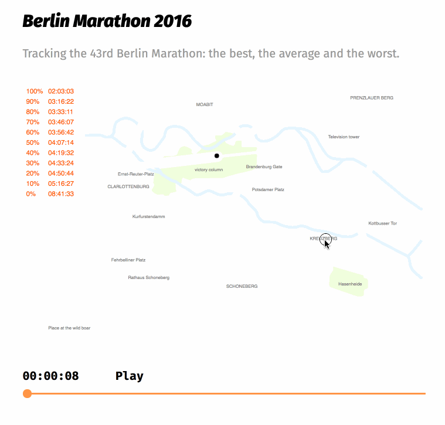

## A simple interactive / animated map

This app is replicated from [here](https://interaktiv.morgenpost.de/berlin-marathon-2016/).

Note: The color of the track didn't show properly on the screen-capture software...

---

## Instruction
To run the app, you need to download `example_10.js`, `example_10.R`, `helper.js` and `r_data`, then source the R file.

The `process_data.R` and `process_data_help.R` are there for your information only. 

Let me know if I missed some files. Thanks.

---
 
## Workflow to create the app from scratch
Back then when I first started, a major challenge was not knowing where to start, so it may be useful if I put down just a few lines about how I create this app.

### Data preparation
1. Get the marathon finishing time data from http://www.bmw-berlin-marathon.com. You may find [this](https://github.com/stappit/berlin-marathon) helpful. (Please use wisely)
2. Trace out landmark points on the svg map using `dev/capture_coordinates.R`(which is also written using `rjs`!).
    - make sure you have the map svg file, `track2.svg`(which is from the website), in the folder and that you are in the right path
    - the app shows up in the viewer, click `open in new window` to see it in a web browser. Then open the browser console, and you will see datapoints show up as you click on the map.
    - copy and paste the coordinates into a empty file, and save it as a JSON file, e.g. `path_data.json`.

3. Interpolate uniformly between the landmark points (using `tweenR` package) 
    - You can see my thinking process in `dev/draft.R`. Basically, `tweenR` does all the heavy work for you.  

### App developement
Here is my sketch plan and time log of the remaining steps.

- get all the quantile time - 12 mins 
- scale animation speed according to time - 2 mins
- plot them all - 52 mins
- add text and font styles - 70 mins  
(nice_fonts.css is also from the website if I remember correctly)
- add timeline - 2 hours
- add toggle button - 43 mins
- add finishing time list - 71 mins
- add speed control - 12 mins

DONE! (6 hours 22 mins)

### Remarks
- The app is not as reusable as I wanted since there are quite a few things I do it manuelly to save time (rather than make it a general pattern). Nevertheless, the "slider-play button-graphics" combination seems to be useful, so that is a take-away.
- One can also use `plotly` with a background image to make this app. I used `d3` because I found some examples on [`d3` website](https://github.com/d3/d3/wiki/gallery) which can be applied here directly. 

